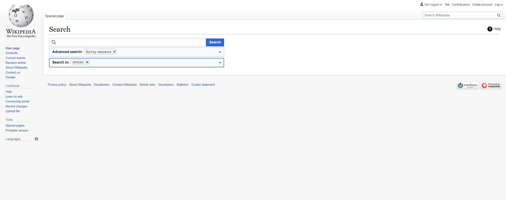
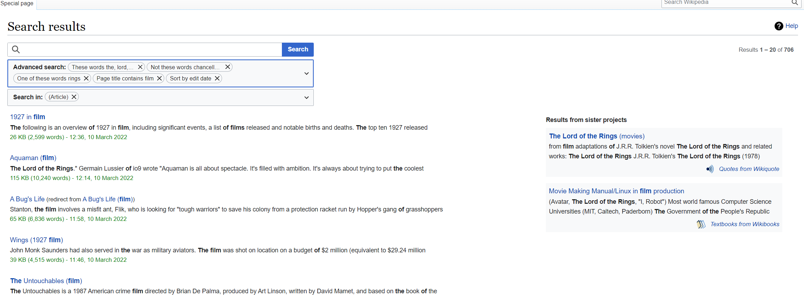
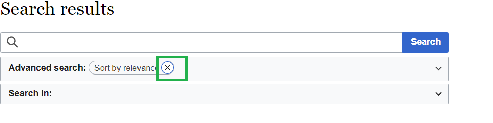

# Wikipedia Search Page: exploratory testing

SUT: a Search page that contains a Wikipedia left menu, logo and a search input with "Advanced search" "Search in" dropdown elements

This will only cover a search input with "Advanced search" "Search in" dropdown elements. Features to test:
* search for a complicated phrase gives appropriate results
* advanced search
* it  is possible to search in multiple categories
* overall usability

Run the tests in 1 desktop Chrome browser and in a mobile Android Chrome (not applicable).

Tests description:

#### Simple search with autocomplete

**Given**: empty search input  
**When**: user starts typing a search phrase 
**Then**: a list with possible variants appears (an autocomplete list), it is possible to interact with it
**And Then**: relevant paginated search results appear under the input.

#### Simple search with max allowed search string

**Given**: empty search input 
**When**:user pastes in a string that exceeds the allowed 255 chars 
**Then**:Search string is cut to 255 chars 
**And Then**: relevant paginated search result (probably just one) appears under the input.

#### Simple search with modifiers

**Given**: empty search input 
**When**:user search for test with modifiers like ~ 
**Then**: relevant paginated search results appear under the input.

#### Advanced search

**Given**: default advanced search  
**When**:user selects filters in dropdown and clicks on Search button 
**Then**:relevant paginated search results appear under the input. 

####Advanced search in search input
**Given**: empty search input  
**When**:user provides advanced filters using their text representation 
**Then**:relevant paginated search results appear under the input. 

#### Reduce Search to "General Help"

**Given**: select Search in "Help" 
**When**:user starts typing a search phrase 
**Then**:autocomplete doesn't take the restriction into account 
**And Then**: relevant search result (empty) appear under the input.

## Testing Notes

* "London is the capital and largest city of England and the United Kingdom. It stands on the River Thames in south-east England at the head of a 50-mile (80 km) estuary down to the North Sea, and has been a major settlement for two millennia.[9] The City of"
gives only 1 page but "London is the capital" for some reason shows message "The page "London is the capital" does not exist..." and the mentioned page appears only on 2nd row. 

* Clicking on links in search results or in information boxes reloads the page. Is it possible to open a link in a new page?

* It is impossible to delete "Sort by relevance" option, although there is a "X" button near it. This maybe a bit misleading.

